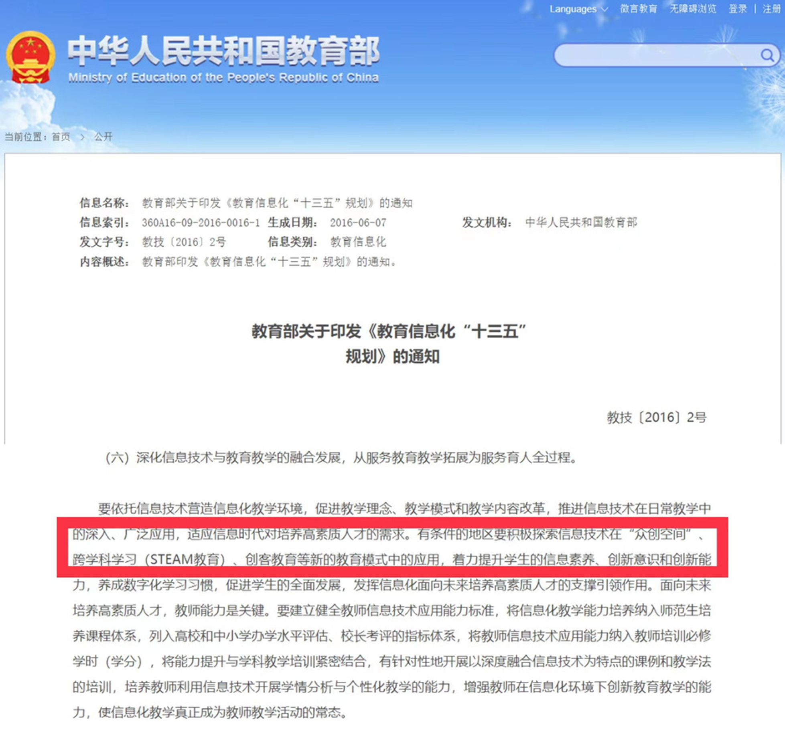
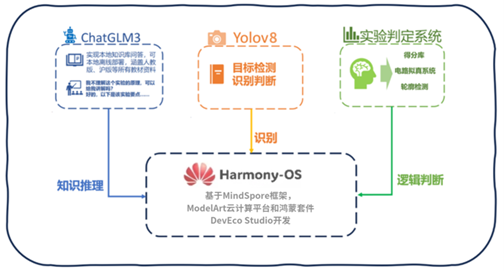
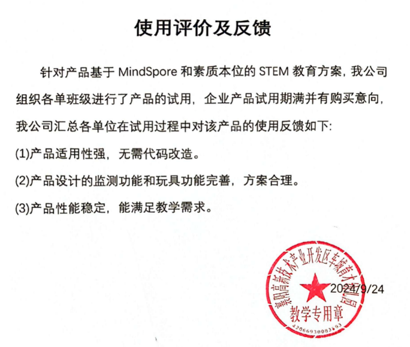

# 智赋英才 - 基于MindSpore和素质本位的STEM教育方案

## 项目概述

“智赋英才”项目旨在通过利用人工智能技术和跨学科教育理念，开发一款集情绪识别、实验教育辅助、和STEM课程辅导为一体的教育系统。该系统基于华为MindSpore框架、ModelArt云计算平台和鸿蒙开发套件，提供多种教学场景下的智能教育解决方案，旨在提高学生学习效果、提升教师教学效率，并为教育机构提供个性化的管理工具。

## 项目背景

2022年10月，习近平总书记在党的二十大报告中再次提出，要“全面贯彻党的教育方针，落实立德树人根本任务，培养德智体美劳全面发展的社会主义建设者和接班人。坚持以人民为中心发展教育，加快建设高质量教育体系，发展素质教育，促进教育公平”。目前，我国的人才结构普遍存在人才培养的层次结构不能与市场需求相匹配、高素质综合能力较强的复合人才匮乏、人才总量缺口较大等问题。受国家对STEM（科学、技术、工程、数学）教育的重视程度不断提升、对创新人才的需求激增的影响，人们对STEM教育产品的需求逐渐增长。通过本项目产品，原本只有少数人可以享受的一对一辅导等教育资源有望普及到更多人。这将使得更多学生能够受益于个性化教学，进而弥补传统教学中普遍存在的、因人力不足和学生差异性等而产生的**教育资源分配不均**的问题。本产品具有可以提高学生综合素质的有趣实验，学生可以在游玩中提升个人能力；同时还配备有试题系统，可以生成相关的知识点让学生作答，以动手+答题相结合的方式**促进学生德智体美劳全面发展**。

<center class ='img'>

</center>

## 项目特点

- **跨学科教育（STEM）**：支持科学、技术、工程、数学等多个学科的综合性学习，旨在提高学生解决复杂问题的能力。
- **情绪识别与实时反馈**：通过情绪识别技术，实时监控学生在实验操作过程中的情感状态，并根据学生情绪调整学习策略。
- **实验教育智能辅导**：采用YOLOv5目标检测技术和OpenCV轮廓判断技术，实现实验过程中器件的实时监测与操作评价。
- **多模态交互**：集成语音识别、视觉监测和触屏操作，提供多种交互方式，提升学生的学习体验。

## 实现方法

### 1. 系统架构

- **MindSpore框架**：用于构建和训练实验教育中使用的深度学习模型。
- **YOLOv5目标检测**：用于实时检测实验中使用的器材，并判断操作是否规范。
- **OpenCV图像处理**：用于判断电路连接、实验器材接入情况。
- **ChatGLM3模型**：集成语言模型实现教育系统的智能问答与知识库管理功能。
- **ResNet情绪识别模型**：用于捕捉学生在实验操作过程中的情绪状态，辅助学习进度管理。

### 2. 数据处理与训练
- **数据集制作**：制作实验器材和表情识别的数据集，采用数据增强技术提升模型性能。
- **训练环境**：在华为开发板上训练YOLOv5模型，并基于FER2013数据集训练表情识别模型。

### 3. 模型微调与优化
- 使用MindSpore进行模型训练，并利用Pinecone向量数据库提升知识库匹配效率。
- 采用LangChain开发框架，构建基于大语言模型的教育场景Agent，实现复杂问题的智能解答。

<center class ='img'>

</center>


## 功能亮点

- **智能实验辅导系统**：通过摄像头实时监控学生实验操作，自动评分并提供操作建议。
- **个性化学习路径推荐**：基于学生情绪与操作表现，动态调整学习内容，提供定制化学习建议。
- **开放式API接口**：通过开发多种实验教育API，支持教师根据需求定制实验项目和学习流程。
- **多终端支持**：集成DevEco Studio开发平台，实现PC端与移动端的多端交互。

## 项目技术栈

- **开发框架**：MindSpore、LangChain
- **模型架构**：YOLOv5、ResNet18/34、ChatGLM3
- **平台工具**：ModelArt、DevEco Studio
- **数据库**：MySQL + 本地视频保存 + 云服务器

## 项目结构

- **主程序文件**：
  - `main.py`: 系统主程序入口
  - `model_training.py`: 模型训练与优化代码
  - `emotion_detection.py`: 情绪检测模块
  - `experiment_assessment.py`: 实验监控与评价模块

- **数据文件**：
  - `data/`: 存放项目使用的所有数据集和预训练模型。
  - `config/`: 存放项目相关的配置文件（数据库、模型路径等）。

- **文档文件**：
  - `docs/`: 包含项目相关的技术文档和使用说明。

## 安装与运行

### 1. 安装依赖

```bash
pip install -r requirements.txt
```

### 2. 启动系统

```bash
python main.py
```

### 3. 运行情绪检测模块

```bash
python emotion_detection.py
```

### 4. 实验操作评估

```bash
python experiment_assessment.py --input data/student_videos/
```

## 使用场景

- **K12学校与教育机构**：用作实验教育辅导系统、考试评分系统。
- **家庭教育**：提供STEM教育启蒙，通过情感分析与游戏化学习提升儿童学习兴趣。
- **教师与教育机构管理者**：通过数据分析与个性化学习报告，改进教学策略并提升教学质量。

## 应用反馈

本产品在试用中表现卓越，获得了教育界的积极反馈和购买意向；同时在学术领域实现了成果转化，包括两项软件著作权、一个应用软件和一个学术论文，以及一项专利申请，彰显了我们项目的技术实力和商业潜力。
<center class ='img'>

</center>


## 展望与未来

我们计划进一步引入知识图谱技术，扩展STEM教育智能一体机的功能，实现更加智能、互动的学习体验。同时，我们希望通过大规模数据集的收集与模型的持续优化，提升系统在多场景、多学科的教育效果，成为教育智能化的标杆项目。

## 参考文献

- [1] Zhiheng Xi Wenxiang Chen Xin Guo etc. (2023). The Rise and Potential of Large Language Model Based Agents: A Survey. ArXiv abs/2309.07864.
- [2] Lan Y. J. & Chen N. S. (2024). Teachers’ agency in the era of LLM and generative AI. Educational Technology & Society 27(1) I-XVIII.
- [3] 余胜泉胡翔.STEM教育理念与跨学科整合模式[J].开放教育研究201521(04):13-22.DOI:10.13966/j.cnki.kfjyyj.2015.04.002.

